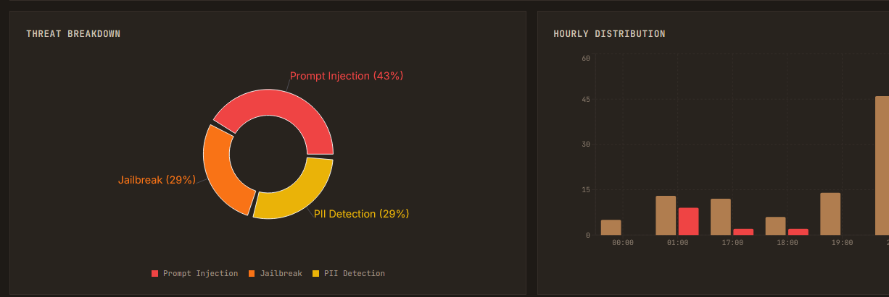

<div align="center">



**Self-hosted LLM firewall with on-device GPU threat detection.**

Analyze every message for prompt injection, jailbreaks, PII leakage, and semantic evasion attacks
using a real 21B-parameter model — not regex, not keyword matching.

[](LICENSE)
[](#testing)
[](https://python.org)
[](https://nodejs.org)
[](#quick-start)
[](#prerequisites)

[Quick Start](#quick-start) &bull; [Connect Clients](#connecting-chat-clients) &bull; [Configuration](#configuration) &bull; [Deployment](DEPLOYMENT.md) &bull; [Security](docs/SECURITY_ASSESSMENT.md)

</div>

---

## Why PooGuard?

Most LLM security tools rely on pattern matching or cloud-hosted classifiers. PooGuard runs a 21-billion parameter MoE safeguard model (3.6B active) directly on your GPU — every request scored locally, nothing leaves your infrastructure. Deploy it as a drop-in OpenAI-compatible proxy: point SillyTavern, Open WebUI, Chatbox, or any client at PooGuard and every request is analyzed, scored, and logged with zero changes to your setup.

### Threat Detection

- **ML-Powered Classification** — Per-category confidence scores for prompt injection, jailbreak, and PII threats. Calibrated against a 360-example benchmark dataset with F1 scores of 0.79 / 0.65 / 0.89.
- **Semantic Evasion Detection** — 121 attack pattern embeddings across 18 categories catch obfuscated and novel attacks that keyword filters miss.
- **Input Deobfuscation** — Decodes base64, hex, URL encoding, Unicode homoglyphs, l33tspeak, zero-width characters, and whitespace insertion before analysis.

### Defense in Depth

- **Egress Monitoring** — Scans every LLM response for leaked secrets, PII, and system prompt disclosure. Secrets are redacted automatically.
- **Session Tracking** — Cumulative threat scoring with 30-minute half-life decay detects slow-burn attacks spread across multiple messages.
- **Secret Masking** — API keys, AWS credentials, GitHub tokens, and JWTs are auto-redacted in logs. Every admin action is recorded in an immutable audit trail.

### Operations

- **OAI-Compatible Proxy** — Drop-in replacement for any OpenAI base URL. Authenticate with API keys, and PooGuard transparently analyzes, blocks, or forwards every request.
- **Real-Time Dashboard** — Live WebSocket feed with per-category threat scores, timeline charts, analytics, and hourly distribution views.
- **Configurable Presets** — Three calibrated profiles: High Security, Balanced (default), and Low Friction. Or set custom thresholds per category.
- **Alert System** — Six alert types (threshold, rate, session_threat, access_pattern, config_change, repeat_block) with real-time notifications.

## Performance

Benchmarked on RTX 5090 (32 GB) with the 20B model in MXFP4 quantization, 360-example dataset:

| Metric | Latency |
|--------|--------:|
| Mean | 2.6s |
| Median | 2.8s |
| P95 | 3.6s |
| Clean inputs (avg) | 1.9s |
| Threat inputs (avg) | 3.1s |

Early-exit stopping cuts clean-input latency nearly in half — most production traffic is clean. Streaming proxy requests begin forwarding immediately; analysis runs in parallel.

## Quick Start

> [!NOTE]
> Requires an **NVIDIA GPU** with 16 GB+ VRAM (RTX 4080 or better). First run downloads the ~13 GB model — cached in a Docker volume for subsequent starts.

```bash
git clone https://github.com/tacos8me/PooGuard.git
cd PooGuard
cp .env.example .env
# Edit .env — set at minimum: HF_TOKEN, JWT_SECRET, DB_PASSWORD
docker compose up
```

| Service   | URL                      |
|-----------|--------------------------|
| Dashboard | http://localhost:3000     |
| API       | http://localhost:3001     |
| Proxy     | http://localhost:3001/v1  |

Default login: `admin@pooguard.local` with a randomly generated password (printed to console on first seed, or set `ADMIN_PASSWORD` env var).

### Prerequisites

- **Docker** and **Docker Compose v2** ([install guide](https://docs.docker.com/engine/install/))
- **NVIDIA Container Toolkit** for GPU passthrough ([install guide](https://docs.nvidia.com/datacenter/cloud-native/container-toolkit/latest/install-guide.html))
- **HuggingFace account** — accept the [model license](https://huggingface.co/openai/gpt-oss-safeguard-20b) before first run

## Request Flow

```
Request ➜ Auth ➜ Extract ➜ Normalize ➜ Classify ➜ Evaluate ➜ Forward ➜ Upstream LLM
                                                      |               |
                                                    Block         Response
                                                      |               |
                                                      ▼               ▼
                                                   Client  ◀── Egress Scan
```

<details>
<summary>Detailed pipeline steps</summary>

1. **Authentication** — `/v1/chat/completions` accepts JWT tokens or PooGuard API keys (`sk-pg-*`). Credentials validated via SHA-256 hash lookup.
2. **Rate Limiting** — User-based tiered limits (admin: 100/min, API key: 60/min, viewer: 30/min, anonymous: 15/min) using Redis-backed sliding windows.
3. **Text Extraction** — User messages extracted from the OpenAI-format `messages` array, including multi-part content.
4. **Input Normalization** — Multi-layer deobfuscation: invisible Unicode stripping, NFKC normalization, homoglyph replacement, whitespace collapse, iterative decoding (base64, hex, URL, l33t, ROT13).
5. **Threat Classification** — Safeguard model runs inference on normalized text, returning per-category scores.
6. **Semantic Similarity** — Input embedding compared against 121 attack pattern embeddings across 18 categories.
7. **Threshold Evaluation** — Calibrated scores compared against configurable thresholds. Each category independently triggers block, flag, or allow.
8. **Forward or Block** — Safe requests forwarded to upstream LLM. Both streaming (SSE) and non-streaming supported.
9. **Egress Monitoring** — Response body scanned for leaked secrets, PII, and sensitive data before delivery.
10. **Event Broadcast** — Logged to PostgreSQL, published to Redis, dashboard updated via WebSocket in real time.

</details>

## Connecting Chat Clients

PooGuard exposes an OpenAI-compatible proxy at `/v1`. Any client that supports a custom base URL works out of the box.

**Create an API key:** Log in to the dashboard, go to **Settings > API Keys**, and create a key (`sk-pg-<hex>`). Copy it immediately — shown only once.

```bash
# curl
curl http://localhost:3001/v1/chat/completions \
  -H "Authorization: Bearer sk-pg-YOUR_KEY" \
  -H "Content-Type: application/json" \
  -d '{
    "model": "any-model-name",
    "messages": [{"role": "user", "content": "Hello!"}]
  }'
```

```bash
# Any OAI-compatible client
export OPENAI_BASE_URL=http://your-server:3001/v1
export OPENAI_API_KEY=sk-pg-YOUR_KEY
```

<details>
<summary>SillyTavern / Open WebUI setup</summary>

**SillyTavern:**
1. Open **Settings > API Connections**
2. Set API type to **Chat Completion (OpenAI)**
3. Set base URL to `http://your-server:3001/v1`
4. Paste your `sk-pg-` API key
5. Pick any model — PooGuard forwards to your upstream

**Open WebUI:**
1. Go to **Settings > Connections**
2. Add an OpenAI-compatible connection
3. Set URL to `http://your-server:3001/v1`
4. Paste your API key

</details>

## Configuration

### Environment Variables

| Variable | Required | Default | Description |
|----------|----------|---------|-------------|
| `HF_TOKEN` | Yes | — | HuggingFace token for model download |
| `JWT_SECRET` | Yes | — | Token signing key (min 32 chars) |
| `DB_PASSWORD` | Yes | — | PostgreSQL password |
| `REDIS_PASSWORD` | No | `redis-dev-password` | Redis authentication password |
| `MODEL_NAME` | No | `openai/gpt-oss-safeguard-20b` | HuggingFace model name |
| `SAFEGUARD_MODEL_SIZE` | No | `20b` | Model variant: `20b` or `120b` |
| `MODEL_SERVICE_API_KEY` | No | — | Backend-to-model-service auth key |
| `ALLOWED_ORIGINS` | No | `localhost:3000,5173` | CORS allowed origins |

### Detection Thresholds

Tune detection sensitivity from the dashboard **Settings** page:

| Preset | Prompt Injection | Jailbreak | PII | Semantic | Use Case |
|--------|:---:|:---:|:---:|:---:|----------|
| **High Security** | 0.40 | 0.40 | 0.50 | 0.28 | Maximize detection, accept more false positives |
| **Balanced** | 0.70 | 0.70 | 0.70 | 0.42 | Best F1 score (default) |
| **Low Friction** | 0.90 | 0.90 | 0.90 | 0.50 | Minimize false positives |

> [!TIP]
> The model produces bimodal scores (near 0.0 or 0.8–0.95), so small threshold changes in the middle range have little practical effect. Lower thresholds = more aggressive blocking.

## Testing

```bash
cd backend && npx jest --no-coverage      # 449 tests
cd model-service && python -m pytest tests/ -v  # 216 tests
cd frontend && npx vitest run             # 31 tests
```

| Suite | Framework | Tests | Coverage |
|-------|-----------|------:|----------|
| Backend | Jest + Supertest | 449 | Routes, middleware, services, utilities |
| Model Service | pytest | 216 | Inference, normalization, semantic similarity, API |
| Frontend | Vitest | 31 | Components, auth flows, settings |

## Development

<details>
<summary>Running with Docker (recommended)</summary>

```bash
docker compose -f docker-compose.yml -f docker-compose.dev.yml up
```

Mounts source directories for hot reload — backend with nodemon, frontend with Vite HMR, model service with live `main.py` mounting. Dev mode also exposes PostgreSQL (5432), Redis (6379), and model-service (8000) for direct access.

</details>

<details>
<summary>Running services individually</summary>

```bash
# Backend
cd backend && npm install && npm run migrate && npm run dev

# Frontend
cd frontend && npm install && npm run dev

# Model service (requires GPU)
cd model-service && pip install -r requirements.txt
uvicorn main:app --host 0.0.0.0 --port 8000
```

</details>

<details>
<summary>Tech stack</summary>

| Layer | Technology | Purpose |
|-------|-----------|---------|
| ML Inference | PyTorch (CUDA 12.8), Transformers | GPU model inference with MXFP4 quantization |
| Embeddings | sentence-transformers | Semantic similarity attack detection |
| Model API | Python 3.12, FastAPI, Uvicorn | Threat classification service |
| Backend | Node.js, Express 4 | REST API, WebSocket, LLM proxy |
| Auth | jsonwebtoken, bcrypt | JWT + SHA-256 hashed API keys |
| Database | PostgreSQL 16, Knex.js | Request logs, config, audit trail, alerts |
| Cache / PubSub | Redis 7 | Rate limiting, cache, real-time event bus |
| Real-time | Socket.IO 4 | WebSocket events to dashboard |
| Frontend | React 18, Vite 5, TailwindCSS 3 | Monitoring dashboard |
| Charts | Recharts 2 | Analytics visualizations |
| Security | Helmet, CORS, CSRF | HTTP hardening |
| Infrastructure | Docker Compose | Multi-service orchestration with GPU passthrough |

</details>

## Contributing

Contributions welcome. Please open an issue first to discuss what you'd like to change.

1. Fork the repository
2. Create a feature branch (`git checkout -b feature/my-change`)
3. Run the test suites before submitting
4. Open a pull request

## License

[MIT](LICENSE)
